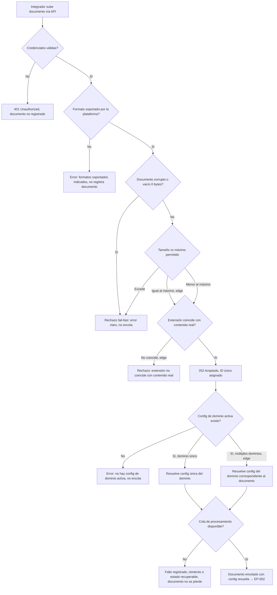

# EP-001 — Ingesta y validación de documentos

> Actor: Integrador. Flujo de decisión (validación fail-fast + resolución de config + encolado), por eso se modela como `flowchart TD` en vez de `sequenceDiagram`.

## Cobertura

- HU-003 (4/4 escenarios): happy (auth+formato ok → 202), error sin auth, error formato no soportado, edge tamaño exacto en el límite.
- HU-004 (4/4 escenarios): rechazo por corrupto, vacío, tamaño excedido, y edge de extensión que no coincide con el contenido real.
- HU-005 (4/4 escenarios): resolución de config + encolado happy, error sin config activa, error de cola no disponible (recuperable), edge de múltiples dominios activos.

## Trazabilidad

| Paso | HU | AC |
|---|---|---|
| A→B | HU-003 | Esc. 2 (error, sin auth) |
| B→B1 | HU-003 | Esc. 2 (error, sin auth) |
| B→C | HU-003 | Esc. 1 (happy) |
| C→C1 | HU-003 | Esc. 3 (error, formato no soportado) |
| C→D | HU-004 | Esc. 1 (happy) |
| D→D1 | HU-004 | Esc. 1 (error, corrupto/vacío) |
| D→E | HU-004 | Esc. 2 (error, tamaño) |
| E→D1 | HU-004 | Esc. 2 (error, tamaño excedido) |
| E→F (edge tamaño exacto) | HU-003 | Esc. 4 (edge, tamaño exacto en el límite) |
| E→F | HU-004 | Esc. 3 (happy, tamaño dentro del límite) |
| F→F1 | HU-004 | Esc. 4 (edge, extensión no coincide) |
| F→G | HU-003 | Esc. 1 (happy, 202 Aceptado) |
| G→I | HU-005 | Esc. 1 (happy) |
| I→I1 | HU-005 | Esc. 2 (error, sin config activa) |
| I→K | HU-005 | Esc. 1 (happy, dominio único) |
| I→J1 | HU-005 | Esc. 4 (edge, múltiples dominios) |
| K→L / J1→L | HU-005 | Esc. 1 (happy) |
| L→L1 | HU-005 | Esc. 3 (error, cola no disponible) |
| L→M | HU-005 | Esc. 1 (happy, documento encolado) |

## Huecos detectados

Ninguno dentro del alcance de esta épica — las 3 historias de EP-001 quedan completamente referenciadas.

## Siguiente paso

`/factory:revisar` una vez estén los 6 flows escritos, para disparar `flows-auditor` y `trazabilidad-auditor`.
