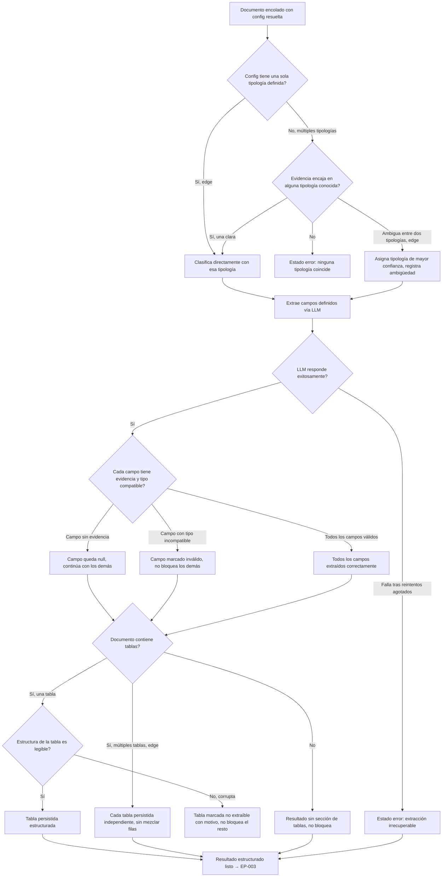

# EP-002 — Procesamiento LLM configurable

> Sin actor humano directo (procesamiento asíncrono disparado por EP-001) — cadena de decisiones internas, por eso `flowchart TD`.

## Cobertura

- HU-007 (4/4 escenarios): clasificación happy, error sin tipología que encaje, edge de config con una sola tipología, edge de evidencia ambigua entre dos tipologías.
- HU-017 (3/3 escenarios): extracción happy de todos los campos, error de fallo LLM irrecuperable tras reintentos, edge de campo sin evidencia (null).
- HU-018 (3/3 escenarios): campo válido happy, error de campo con tipo incompatible (inválido, no bloqueante), edge de campo `null` excluido de la validación de tipo (cubierto en la rama de HU-017).
- HU-008 (4/4 escenarios): extracción de tabla happy, ausencia de tablas (caso feliz sin sección), error de tabla con estructura irregular, edge de múltiples tablas independientes.

## Trazabilidad

| Paso | HU | AC |
|---|---|---|
| A→B / B→C / B→D / D→D1 / D→C / D→D2 | HU-007 | Esc. 1, 2, 3, 4 |
| C→E / D2→E | HU-017 | Esc. 1 (happy) |
| E→F | HU-017 | Esc. 1 (happy) |
| F→F1 | HU-017 | Esc. 2 (error, reintentos agotados) |
| F→G | HU-018 | Esc. 1 (happy) |
| G→G1 | HU-017 | Esc. 3 (edge, campo sin evidencia) |
| G→G2 | HU-018 | Esc. 2 (error, tipo incompatible) |
| G→H | HU-018 | Esc. 1 (happy, todos válidos) |
| G1→I / G2→I / H→I | HU-008 | Esc. 1, 2, 3 |
| I→I1 | HU-008 | Esc. 2 (sin tablas) |
| I→J / J→J1 / J→K | HU-008 | Esc. 1, 3 |
| I→K1 | HU-008 | Esc. 4 (edge, múltiples tablas) |

## Huecos detectados

Ninguno dentro del alcance de esta épica — las 4 historias de EP-002 (HU-017, HU-018, HU-007, HU-008) quedan completamente referenciadas. Ambigüedades ya documentadas en las HU (política de reintentos LLM, umbral de confianza de clasificación) siguen pendientes del ADR pausado — no bloquean el flow, solo el detalle de implementación.

## Siguiente paso

`/factory:revisar` una vez estén los 6 flows escritos.
