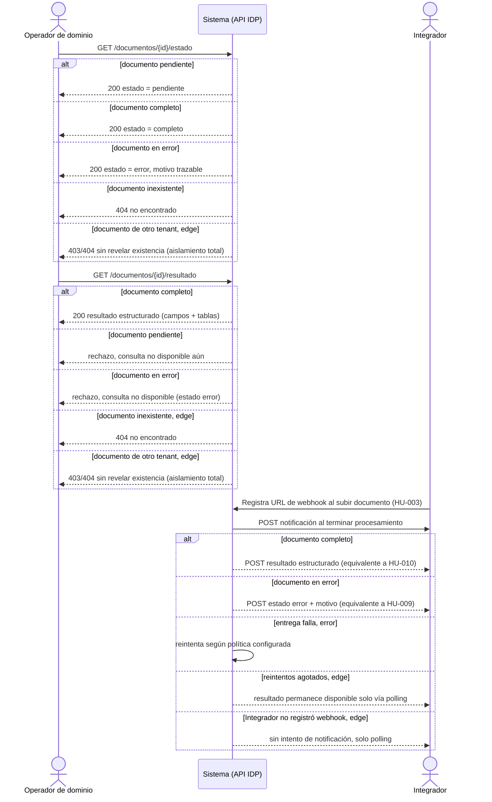

# EP-003 — Consulta de resultados

> Ida y vuelta actor↔sistema (polling), por eso `sequenceDiagram`.

## Cobertura

- HU-009 (5/5 escenarios): pendiente, completo, error con motivo, inexistente (404), y edge de aislamiento entre tenants (403/404 sin revelar existencia).
- HU-010 (5/5 escenarios): resultado de documento completo, rechazo sobre documento pendiente, rechazo sobre documento en error, edge inexistente (404), edge aislamiento entre tenants.
- HU-016 (5/5 escenarios): notificación de documento completo, notificación de documento en error, reintento de entrega fallida, edge de reintentos agotados (fallback a polling), edge de Integrador sin webhook registrado (solo polling).

## Trazabilidad

| Paso | HU | AC |
|---|---|---|
| GET /estado → pendiente | HU-009 | Esc. 1 |
| GET /estado → completo | HU-009 | Esc. 2 (happy) |
| GET /estado → error | HU-009 | Esc. 3 |
| GET /estado → inexistente | HU-009 | Esc. 4 |
| GET /estado → otro tenant, edge | HU-009 | Esc. 5 (edge, aislamiento) |
| GET /resultado → completo | HU-010 | Esc. 1 (happy) |
| GET /resultado → pendiente | HU-010 | Esc. 2 |
| GET /resultado → error | HU-010 | Esc. 3 |
| GET /resultado → inexistente, edge | HU-010 | Esc. 4 |
| GET /resultado → otro tenant, edge | HU-010 | Esc. 5 (edge, aislamiento) |
| Notificación → completo | HU-016 | Esc. 1 (happy) |
| Notificación → error | HU-016 | Esc. 2 |
| Entrega falla, reintento | HU-016 | Esc. 3 |
| Reintentos agotados, edge | HU-016 | Esc. 4 |
| Integrador sin webhook, edge | HU-016 | Esc. 5 |

## Huecos detectados

Ninguno — el patrón push/webhook, antes documentado como hueco, quedó formalizado en HU-016 (decisión de ADR: "soportar ambos desde el diseño"). Ambigüedad pendiente: la política exacta de reintentos de entrega del webhook queda para el ADR, mismo tratamiento que otras políticas de reintento pendientes (HU-017).

## Siguiente paso

`/factory:revisar` una vez estén los 6 flows escritos.
