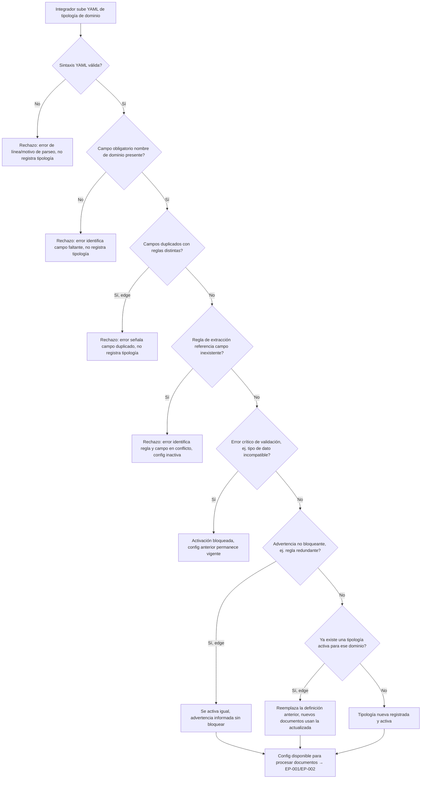

# EP-004 — Configuración de dominio (tipologías pluggable)

> Cadena de validación fail-fast con múltiples puntos de rechazo — `flowchart TD`.

## Cobertura

- HU-001 (5/5 escenarios): definición válida happy, error de sintaxis YAML, error de campo obligatorio faltante, edge de redefinición de tipología existente, edge de campos duplicados.
- HU-002 (4/4 escenarios): validación y activación happy, error de regla inconsistente, error crítico que bloquea activación (config anterior vigente), edge de advertencia no bloqueante.

## Trazabilidad

| Paso | HU | AC |
|---|---|---|
| A→B | HU-001 | Esc. 1 (happy) |
| B→B1 | HU-001 | Esc. 2 (error, sintaxis YAML) |
| B→C | HU-001 | Esc. 1 (happy) |
| C→C1 | HU-001 | Esc. 3 (error, campo faltante) |
| C→D | HU-001 | Esc. 1 (happy) |
| D→D1 | HU-001 | Esc. 5 (edge, campos duplicados) |
| D→E | HU-002 | Esc. 1 (happy) |
| E→E1 | HU-002 | Esc. 2 (error, regla inconsistente) |
| E→F | HU-002 | Esc. 1 (happy) |
| F→F1 | HU-002 | Esc. 3 (error crítico, config anterior vigente) |
| F→G | HU-002 | Esc. 1 (happy) |
| G→G1 | HU-002 | Esc. 4 (edge, advertencia no bloqueante) |
| G→H | HU-001 | Esc. 1 (happy) |
| H→H1 | HU-001 | Esc. 4 (edge, redefinición) |
| H→I | HU-001 | Esc. 1 (happy, tipología nueva registrada) |
| G1→Z / H1→Z / I→Z | HU-001, HU-002 | Cierre de config disponible |

## Huecos detectados

Ninguno dentro del alcance de esta épica — las 2 historias de EP-004 quedan completamente referenciadas.

## Siguiente paso

`/factory:revisar` una vez estén los 6 flows escritos.
