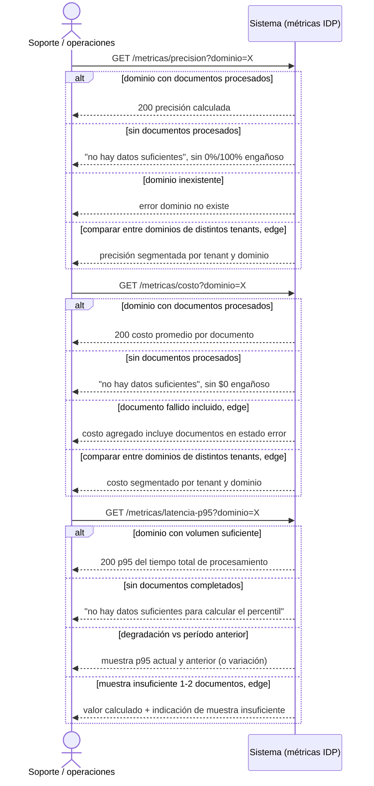

# EP-005 — Observabilidad de KPIs

> Ida y vuelta actor↔sistema por cada KPI consultado — `sequenceDiagram`.

## Cobertura

- HU-011 (4/4 escenarios): precisión happy, error sin datos suficientes, error dominio inexistente, edge de comparación segmentada entre tenants.
- HU-012 (4/4 escenarios): costo promedio happy, error sin datos suficientes, edge de documento fallido incluido en el agregado, edge de comparación segmentada entre tenants.
- HU-013 (4/4 escenarios): p95 happy, error sin documentos completados, detección de degradación vs período anterior, edge de muestra insuficiente (1-2 documentos).

## Trazabilidad

| Paso | HU | AC |
|---|---|---|
| GET /precision → con datos | HU-011 | Esc. 1 (happy) |
| GET /precision → sin datos | HU-011 | Esc. 2 |
| GET /precision → dominio inexistente | HU-011 | Esc. 3 |
| GET /precision → entre tenants, edge | HU-011 | Esc. 4 (edge) |
| GET /costo → con datos | HU-012 | Esc. 1 (happy) |
| GET /costo → sin datos | HU-012 | Esc. 2 |
| GET /costo → doc fallido incluido, edge | HU-012 | Esc. 3 (edge) |
| GET /costo → entre tenants, edge | HU-012 | Esc. 4 (edge) |
| GET /latencia-p95 → volumen suficiente | HU-013 | Esc. 1 (happy) |
| GET /latencia-p95 → sin datos | HU-013 | Esc. 2 |
| GET /latencia-p95 → degradación | HU-013 | Esc. 3 |
| GET /latencia-p95 → muestra insuficiente, edge | HU-013 | Esc. 4 (edge) |

## Huecos detectados

Ninguno dentro del alcance de esta épica — las 3 historias de EP-005 quedan completamente referenciadas. Ambigüedades ya documentadas en las HU (método de cálculo de precisión, tamaño mínimo de muestra, período de comparación por defecto) siguen pendientes del ADR pausado. Actor corregido a "Soporte / operaciones" (PRD §Stakeholders) — "Operador de plataforma" no está declarado.

## Siguiente paso

`/factory:revisar` una vez estén los 6 flows escritos.
