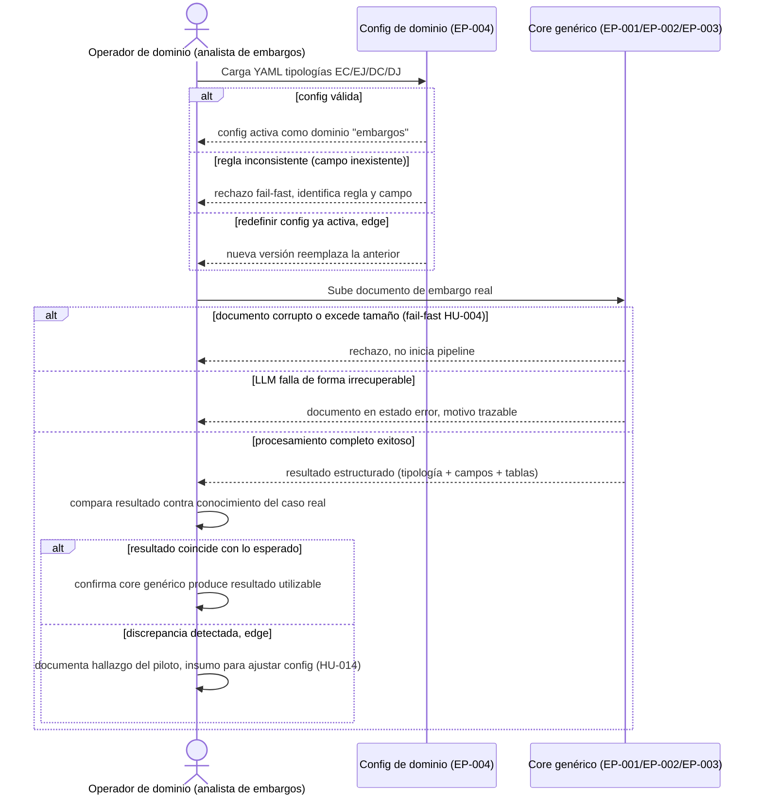

# EP-006 — Piloto vertical: embargos y desembargos

> Orquesta capacidades ya existentes de EP-001 a EP-004 en secuencia — `sequenceDiagram`.

## Cobertura

- HU-014 (3/3 escenarios): carga válida happy, error de regla inconsistente rechazada fail-fast, edge de redefinición de config ya activa.
- HU-015 (4/4 escenarios): procesamiento e2e happy, error de documento rechazado por inválido, error de fallo LLM irrecuperable, edge de discrepancia entre resultado y conocimiento del analista (hallazgo del piloto, no fallo técnico).

## Trazabilidad

| Paso | HU | AC |
|---|---|---|
| Carga config → válida | HU-014 | Esc. 1 (happy) |
| Carga config → regla inconsistente | HU-014 | Esc. 2 |
| Carga config → redefinir, edge | HU-014 | Esc. 3 (edge) |
| Sube documento → corrupto/excede tamaño | HU-015 | Esc. 2 |
| Sube documento → LLM falla | HU-015 | Esc. 3 |
| Sube documento → completo exitoso | HU-015 | Esc. 1 (happy) |
| Compara → coincide | HU-015 | Esc. 1 (happy) |
| Compara → discrepancia, edge | HU-015 | Esc. 4 (edge) |

## Huecos detectados

Ninguno dentro del alcance de esta épica — las 2 historias de EP-006 quedan completamente referenciadas. Ambigüedades ya documentadas en HU-015 (criterio objetivo de "correcto", tamaño de muestra del piloto) siguen pendientes del ADR pausado.

## Siguiente paso

`/factory:revisar` una vez estén los 6 flows escritos — es el último de los 6, cierra la tarea #10 del pipeline funcional.
