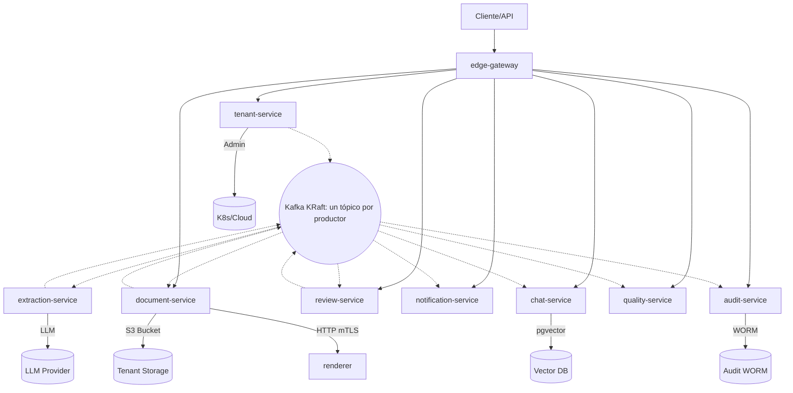
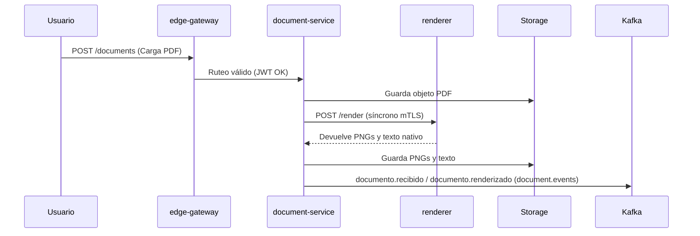
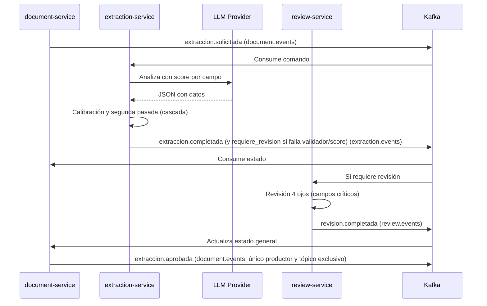

# Arquitectura del Sistema: IDP Bancario

Este documento describe la arquitectura del sistema de Procesamiento Inteligente de Documentos (IDP) para la extracción de oficios de embargo/desembargo y chat documental.

## 1. Vista General

La plataforma está diseñada en una arquitectura de microservicios guiada por eventos, orientada a separar responsabilidades según fronteras de confianza.

## 2. Componentes

### 2.1 `edge-gateway`
- **Responsabilidad:** Terminación TLS, validación de firma y expiración de JWT, rate limit, ruteo, límites de tamaño.
- **Datos:** Redis compartido de plataforma SOLO con contadores (sin datos de tenant), en alta disponibilidad con réplica. Si Redis cae, se usa limitador local en memoria por réplica (degradación segura). Sin base de datos.
- **API:** Expone rutas públicas. Exporta rechazos (401/429) como logs de seguridad hacia SIEM/WORM vía colector de logs.
- **Eventos:** Ninguno directamente.
- **Privilegios:** Único componente expuesto a internet.
- **Escalado:** Horizontal por CPU/memoria.
- **Controles SEC:** SEC-002, SEC-003, SEC-005, SEC-011, SEC-014, SEC-023, SEC-030.

### 2.2 `document-service`
- **Responsabilidad:** Orquestador del pipeline, carga idempotente, versiones.
- **Datos:** Base de datos relacional (silo por tenant).
- **API:** `POST /documents`, `GET /documents/{id}`.
- **Llamadas síncronas:** Llamada HTTP síncrona hacia `renderer` (mTLS).
- **Eventos:** Consume `documento.renderizado` (propio), `extraccion.completada` (de extraction-service), `extraccion.requiere_revision`, `revision.completada`. Publica `extraccion.solicitada` (comando), `extraccion.aprobada` (único productor autorizado), `documento.recibido`, `documento.rechazado`, `documento.purgado`.
- **Privilegios:** Escritura en el bucket del tenant. Guarda PNG y texto nativo extraído.
- **Escalado:** Horizontal. Equidad controlada por tope de concurrencia por tenant (bulkhead Resilience4j).
- **Controles SEC:** SEC-001, SEC-018, SEC-019, SEC-021, SEC-022, SEC-029, SEC-050.

### 2.3 `renderer`
- **Responsabilidad:** Validación (magic bytes), escaneo antivirus, rasterizado de PDF a PNG y extracción de capa de texto nativa si existe. Convierte DOCX a PDF con LibreOffice headless dentro del mismo sandbox (sin red, timeout y límite de tamaño y páginas, macros deshabilitadas) y luego rasteriza; imágenes JPG/PNG/TIFF pasan directo.
- **Datos:** Efímeros.
- **API:** HTTP síncrona (mTLS).
- **Eventos:** No usa Kafka.
- **Privilegios:** Sandbox aislado. Sistema de archivos de solo lectura. Sin credenciales. NetworkPolicy: ingress solo desde document-service, egress denegado (excepto CronJob freshclam hacia mirror interno).
- **Antivirus:** clamd como sidecar en el pod.
- **Escalado:** Horizontal intensivo en CPU.
- **Controles SEC:** SEC-024, SEC-025.

### 2.4 `extraction-service`
- **Responsabilidad:** Clasificación, extracción con LLM, validadores, calibración de score por campo, ruteo en cascada.
- **Datos:** Base local temporal por lote.
- **API:** Worker de eventos.
- **Eventos:** Consume `extraccion.solicitada`. Publica `extraccion.completada`, `extraccion.requiere_revision`, `ia.ejecucion_registrada`.
- **Privilegios:** Credenciales LLM.
- **Escalado:** Horizontal según cuota y límites de concurrencia por tenant hacia el LLM.
- **Controles SEC:** SEC-031, SEC-032, SEC-033, SEC-034, SEC-036, SEC-049, SEC-050.

### 2.5 `review-service`
- **Responsabilidad:** Cola de revisión manual (HITL), regla de cuatro ojos para campos críticos (monto, identificación, cuenta/producto, tipo de medida).
- **Datos:** `review_task`, `correction`.
- **API:** `GET /tasks`, `POST /tasks/{id}/approve`.
- **Eventos:** Consume `extraccion.requiere_revision` y `calidad.muestra_ciega_solicitada` (tarea de revisión ciega de un oficio ya auto-aprobado, sin cambiar el estado del documento). Publica `revision.completada` (con `blindSample=true` en la revisión ciega) y `revision.escalada` (SLA vencido).
- **Privilegios:** Validación de rol revisor y segundo aprobador distinto para campos críticos; en la revisión ciega, revisor distinto de quien intervino en el documento y sin ver la salida del modelo.
- **Escalado:** Bajo/Medio.
- **Controles SEC:** SEC-009, SEC-034, SEC-050, SEC-051.

### 2.6 `quality-service`
- **Responsabilidad:** Golden set con oficios sintéticos, muestreo ciego, deriva, calibración.
- **Datos:** Métricas QA.
- **API:** Interna y exportación de reportes (rol riesgo de modelo).
- **Eventos:** Consume `extraccion.aprobada` y `revision.completada`. Publica `calidad.muestra_ciega_solicitada` (único productor) por outbox en la base de control.
- **Privilegios:** Lectura golden set, evaluación independiente.
- **Escalado:** Bajo.
- **Controles SEC:** SEC-035, SEC-051.

### 2.7 `chat-service`
- **Responsabilidad:** RAG, pgvector, citación verificable. Abstención obligatoria ante información insuficiente. Búsqueda exacta por `document_id`.
- **Datos:** `chat_session`, `chunk`, `citation`.
- **API:** `POST /chat/{sessionId}/message`.
- **Eventos:** Consume `extraccion.aprobada`. Publica `chat.respuesta_bloqueada`, `chat.respuesta_desde_cache`, `seguridad.prompt_injection_detectado`.
- **Privilegios:** Lectura documentos y credenciales LLM.
- **Escalado:** Horizontal. Bulkhead por tenant.
- **Controles SEC:** SEC-001, SEC-004, SEC-007, SEC-031, SEC-033, SEC-038, SEC-048, SEC-050.

### 2.8 `notification-service`
- **Responsabilidad:** Webhooks HMAC seguros, reintentos DLT, validación anti-SSRF rigurosa (bloqueo RFC1918, loopback, CGNAT, metadata; DNS pinning; redirects deshabilitados).
- **Datos:** Configuración webhooks.
- **API:** CRUD de webhooks por tenant.
- **Eventos:** Consume `extraccion.aprobada` y `revision.escalada`. Publica `webhook.entregado`, `webhook.fallido`.
- **Privilegios:** Única salida a internet (egress controlado).
- **Escalado:** Medio.
- **Controles SEC:** SEC-027, SEC-028, SEC-050.

### 2.9 `audit-service`
- **Responsabilidad:** Cadena de hash, anclaje WORM por tenant, firma asimétrica (ed25519) del expediente.
- **Datos:** WORM S3, metadatos hash.
- **API:** Exportación de expedientes (rol auditor).
- **Eventos:** Consume todos los eventos de dominio de forma bloqueante para mantener el orden.
- **Privilegios:** Escritor único de auditoría WORM y gestor de llave asimétrica de firma. Rol no revocable.
- **Escalado:** Alto.
- **Controles SEC:** SEC-021, SEC-039, SEC-040, SEC-042.

### 2.10 `tenant-service`
- **Responsabilidad:** Alta/baja tenants, KEK de datos y auditoría separadas, planes, cuotas, aprovisionamiento de recursos. Reporte trimestral de certificación de accesos.
- **Datos:** `tenants`, `planes`, `role_assignment` (base de control).
- **API:** `POST /tenants`, `PUT /tenants/{id}/config`.
- **Eventos:** Publica `tenant.aprovisionado`, `tenant.aprovisionamiento_fallido`, `tenant.baja_iniciada`, `consumo.registrado`, `cuota.umbral_alcanzado`.
- **Privilegios:** Red de administración. Llama a API de Kubernetes/Cloud para crear namespaces y silos físicos.
- **Escalado:** Bajo.
- **Controles SEC:** SEC-001, SEC-012, SEC-015, SEC-016, SEC-017, SEC-047, SEC-050.

### 2.11 Plataforma transversal (libs/security, CI, Kubernetes, observabilidad)
- **Responsabilidad:** Seguridad base, control de accesos, resiliencia, despliegue, observabilidad y auditoría general.
- **Controles SEC:** SEC-006, SEC-008, SEC-010, SEC-013, SEC-020, SEC-026, SEC-037, SEC-041, SEC-043, SEC-044, SEC-045, SEC-046.

## 3. Seguridad y Autorización Común

- **Identidad:** Keycloak actúa como broker OIDC en todos los destinos, federado con el IdP del banco. El token JWT emitido incluye el claim `tenant_id` y los roles.
- **Validación en servicios:** Cada servicio revalida tenant y rol contra `role_assignment` en cada request vía la biblioteca `libs/security`. Esta validación consulta la base de control de forma síncrona con una caché local máxima de 30 segundos, que se invalida inmediatamente al recibir un evento `acceso.revocado`. Ante fallos de autorización, se publica `seguridad.acceso_denegado`.
- **Break-glass:** Aprobador distinto requerido siempre. Genera eventos `breakglass.otorgado` y `breakglass.expirado`. Separación estricta entre administrador de llaves y acceso a contenido.
- **Clasificación de Documentos:** Público, Interno, Confidencial, Altamente Confidencial. Los oficios son Confidencial por defecto. Altamente Confidencial requiere aprobación de un Data Steward distinto del cargador.

## 4. Catálogo de Eventos

Patrón claim-check estricto: cero PII en eventos Kafka. Se usan identificadores y metadatos (SEC-050). Todo userId y recurso en eventos son identificadores opacos (sin PII).

Cada eventType pertenece a un único tópico y a un productor (o a una familia de productores solo en `audit.events`); la asignación vive en `contracts/events/topology.yaml` (fuente única, empaquetada por `libs/events` como `EventTopology`) y se explica en §5 y en el ADR 0029.

| Nombre de Evento | Tipo | Tópico | Productor | Payload Claim-Check |
|---|---|---|---|---|
| `tenant.aprovisionado` | Evento | `idp.tenant.events` | `tenant-service` | `tenantId`, `planId` |
| `tenant.aprovisionamiento_fallido`| Evento | `idp.tenant.events` | `tenant-service` | `tenantId`, `razon` |
| `tenant.baja_iniciada` | Evento | `idp.tenant.events` | `tenant-service` | `tenantId` |
| `documento.recibido` | Evento | `document.events` | `document-service` | `documentId`, `tenantId`, `hash` |
| `documento.renderizado` | Evento | `document.events` | `document-service` | `documentId`, `tenantId`, `pageCount` |
| `documento.rechazado` | Evento | `document.events` | `document-service` | `documentId`, `tenantId`, `motivo` |
| `documento.purgado` | Evento | `document.events` | `document-service` | `documentId`, `tenantId` |
| `extraccion.solicitada` | Comando | `document.events` | `document-service` | `documentId`, `tenantId`, `versionId` |
| `extraccion.completada` | Evento | `extraction.events` | `extraction-service` | `documentId`, `tenantId` |
| `extraccion.requiere_revision`| Evento | `extraction.events` | `extraction-service` (consumidores: `document-service`, `review-service`) | `documentId`, `taskId`, `tenantId` |
| `ia.ejecucion_registrada` | Evento | `extraction.events` | `extraction-service` | `documentId`, `modelVersion`, `promptVersion`, `configHash`, `signatureRef` (SEC-049) |
| `revision.completada` | Evento | `review.events` | `review-service` | `documentId`, `taskId`, `action` (opcionales: `typology`, `blindSample`, `correctedFields[]` solo nombre y tipo) |
| `calidad.muestra_ciega_solicitada` | Evento | `quality.events` | `quality-service` (consumidor: `review-service`) | `documentId`, `tenantId`, `typology`, `sampleId` |
| `revision.escalada` | Evento | `review.events` | `review-service` (consumidor: `notification-service`) | `documentId`, `taskId`, `level`, `slaBreachedAt` |
| `extraccion.aprobada` | Evento | `document.events` | `document-service` | `documentId`, `tenantId`, `finalScore` |
| `seguridad.acceso_denegado` | Evento | `audit.events` | cualquier servicio con Write en `audit.events` | `tenantId`, `userId`, `recurso` |
| `seguridad.prompt_injection_detectado`| Evento| `audit.events` | `extraction-service`, `chat-service` | `documentId`, `tenantId` |
| `acceso.revocado` | Evento | `idp.tenant.events` | `tenant-service` | `userId`, `tenantId` |
| `breakglass.otorgado` | Evento | `idp.tenant.events` | `tenant-service` | `userId`, `approverId` |
| `breakglass.expirado` | Evento | `idp.tenant.events` | `tenant-service` | `userId` |
| `acceso.rol_sensible_otorgado` | Evento | `idp.tenant.events` | `tenant-service` | `subjectId`, `role`, `requestedBy`, `approvedBy` |
| `auditoria.alerta_integridad` | Evento | `audit.events` | `audit-service` | `tenantId`, datos de la alerta sin PII |
| `legalhold.aplicado` | Evento | `audit.events` | `tenant-service`, `audit-service` | `documentId` / `tenantId` |
| `legalhold.liberado` | Evento | `audit.events` | `tenant-service`, `audit-service` | `documentId` / `tenantId` |
| `webhook.entregado` | Evento | `notification.events` | `notification-service` | `webhookId`, `documentId` |
| `webhook.fallido` | Evento | `notification.events` | `notification-service` | `webhookId`, `documentId`, `motivo` |
| `chat.respuesta_bloqueada` | Evento | `audit.events` | `chat-service` | `sessionId`, `tenantId` |
| `chat.respuesta_desde_cache`| Evento | `audit.events` | `chat-service` | `sessionId`, `tenantId` |
| `consumo.registrado` | Evento | `audit.events` | `tenant-service` (cuotas), `extraction-service` (tokens y documentos extraídos) | `tenantId`, `metricName`, `value` |
| `cuota.umbral_alcanzado` | Evento | `idp.tenant.events` | `tenant-service` | `tenantId`, `porcentaje` |

## 5. Topología Kafka y Patrón Outbox

- **Infraestructura:** Kafka en modo KRaft (sin Zookeeper).
- **Tópicos y Particiones:** Tópicos globales (sin tópicos ni credenciales por tenant), uno por productor o familia de productores (ADR 0029). Clave `documentId` en los tópicos del pipeline y `tenantId` en auditoría y tenant. La asignación `eventType -> tópico -> productor -> clave` vive en `contracts/events/topology.yaml` (`EventTopology` en `libs/events`).
- **Tópico de Auditoría:** `audit.events` usa clave `tenantId`. Su consumidor implementa reintento BLOQUEANTE (sin `@RetryableTopic`) para no romper el orden de la hash-chain, disparando alerta en caso de fallo.
- **Seguridad (ACL):** Acceso estricto por `KafkaUser` de Strimzi. Cada servicio tiene `Write` SOLO sobre los tópicos de los eventTypes que produce (más los `*-dlt` de los tópicos que consume) y `Read` sobre los que consume; `renderer` y `edge-gateway` no tienen usuario. Así, ningún servicio puede suplantar a otro productor (p. ej. emitir `revision.completada` o `calidad.muestra_ciega_solicitada`). `tools/ci/check_kafka_topics.py` lo valida en CI contra la topología.
- **Validación de origen (SEC-052):** cada consumidor comprueba que el `eventType` llegó POR el tópico que `EventTopology` le asigna (`EventOriginGuard`, topic del `ConsumerRecord`); si no, ignora el evento, incrementa `idp.events.origin.rejected` y registra una alerta `SECURITY` sin payload. Aplica a document, extraction, review, quality, notification, audit y a los listeners de `libs/security` (`acceso.revocado`, `tenant.baja_iniciada`).
- **Productores:** el relay del outbox de cada servicio publica cada evento en el tópico que dicta `EventTopology` (por eventType, no un tópico fijo por servicio) y encolar o publicar un eventType que el servicio no produce falla de forma explícita.
- **Producción (Outbox):** Se usa una tabla `outbox` en la base de datos de cada tenant (excepción: `quality-service` no tiene silo y usa un `outbox` propio en la base de control; ADR 0028). Un proceso relay por servicio recorre las bases de datos de los tenants con `FOR UPDATE SKIP LOCKED`. Los tenants se reparten por hash entre las réplicas usando ShedLock. Se implementa Debezium diferido.
- **Consumo:** Idempotencia en cada consumidor.

### 5.1 Tabla de Tópicos Kafka

| Nombre de Tópico | Tipo | Clave | Particiones | Retención | Productores (Write exclusivo) | Consumidores |
|---|---|---|---|---|---|---|
| `document.events` | Pipeline | `documentId` | 12 | 7 días | `document-service` | `extraction-service` (`extraccion.solicitada`), `quality-service` (`extraccion.aprobada`), `notification-service` (`extraccion.aprobada`, `documento.rechazado`), `audit-service` |
| `extraction.events` | Pipeline | `documentId` | 12 | 7 días | `extraction-service` | `document-service`, `review-service` (`extraccion.requiere_revision`), `quality-service` (`extraccion.completada`), `audit-service` |
| `review.events` | Pipeline | `documentId` | 6 | 7 días | `review-service` | `document-service`, `quality-service`, `notification-service` (`revision.completada`), `audit-service` |
| `quality.events` | Pipeline | `documentId` | 3 | 7 días | `quality-service` | `review-service` (`calidad.muestra_ciega_solicitada`), `audit-service` |
| `notification.events` | Pipeline | `documentId` | 6 | 7 días | `notification-service` | `audit-service` |
| `idp.tenant.events` | Control de tenant | `tenantId` | 3 | 7 días | `tenant-service` (outbox) | `audit-service`; `document-service`, `extraction-service`, `review-service`, `quality-service`, `notification-service` (grupos efímeros `<app>-acceso-revocado-*` y `<app>-pool-evict-*`, `auto.offset.reset=latest`; eventos `acceso.revocado`, `tenant.baja_iniciada`, `tenant.credenciales_rotadas`) |
| `audit.events` | Auditoría (señales) | `tenantId` | 6 | 365 días | Excepción documentada: varios productores, solo para señales de seguridad y metering (`seguridad.*`, `chat.*`, `consumo.registrado`, `legalhold.*`, `auditoria.alerta_integridad`); cada servicio solo escribe los eventTypes de la topología | `audit-service` |
| `document.events-dlt`, `extraction.events-dlt`, `review.events-dlt`, `quality.events-dlt` | Dead letter | original | = tópico origen | 14 días | Los consumidores de ese tópico (`DeadLetterPublishingRecoverer`, misma partición que el original) | Operación (sin consumidores de pipeline) |

`audit.events` es la única excepción a "un tópico, un productor": sus eventos son señales que `audit-service` ingiere en la cadena de hash pero NO estado autoritativo; ningún servicio actúa sobre ellos como si lo fueran. Los DLT no son tópicos de eventos de dominio: no admiten reproducción hacia el pipeline sin pasar por la validación de origen del consumidor.

El `audit-service` consume todos los tópicos de la topología con su propio consumer group independiente (también valida el tópico de origen de cada evento). Los eventos exclusivos de seguridad van al tópico `audit.events`. El orden de la cadena de hash (hash-chain) está determinado por el orden de ingesta en el `audit-service` y es serializado por tenant en su base de datos, no depende del orden de llegada o retención en Kafka. Al ingerir cada evento, `audit-service` asigna el número de secuencia de la cadena por tenant; esa secuencia (no el offset de Kafka) es la que entra al hash y se firma.

## 6. Modelo de Datos y Silos

- **Silos:** `libs/tenant-context` utiliza `AbstractRoutingDataSource`. Se crea un pool Hikari por tenant bajo demanda con credenciales dinámicas de OpenBao (TTL corto) y un tope de pools activos.
- **Bases de datos (PostgreSQL/pgvector):** Se utiliza `Cluster` CNPG compartido (nivel estándar) asignando una `Database` lógica por tenant. Para nivel dedicado, se aprovisiona un `Cluster` CNPG dedicado completo. CNPG gestiona instancias e integra Barman Cloud para archivado continuo de WAL (garantizando RPO).
- **Aprovisionamiento:** Los recursos de tenant se crean vía API administrativa en namespaces excluidos de Argo CD. La base de control es la fuente de verdad y un job de reconciliación mantiene el estado.

### 6.1 Base de Control (Compartida)
- `tenants`, `planes`, `cuotas`, `role_assignment`, `consumption_record`, `quota_period`.

### 6.2 Base por Tenant (Silo Físico o Lógico)
- `document`, `document_version`, `page`, `outbox`.
- `extraction`, `field_value`.
- `review_task`, `correction`.
- `chat_session`, `chunk`, `citation`, `webhook_subscription`, `webhook_delivery`.

## 7. Diagramas de Flujo (Mermaid)

### 7.1 Carga y Renderizado

### 7.2 Orquestación y Extracción

## 8. Máquina de Estados de Documentos

Los estados canónicos definidos en el producto:
`RECIBIDO` -> `RENDERIZADO` -> `EN_EXTRACCION` -> `EN_REVISION` -> `APROBADO` (o `RECHAZADO` / `FALLIDO`). Los documentos `ALTAMENTE_CONFIDENCIAL` pasan por `APROBADO_PENDIENTE_STEWARD` antes de `APROBADO`: el Data Steward (distinto de quien cargó) lo aprueba con `POST /v1/documents/{id}/approve-confidential`.

## 9. Puertos Java, Adaptadores y Cadena de Suministro

- `ObjectStore`: AWS S3, GCS, Blob nativo, o `s3-compatible-adapter` (Ceph RGW, SeaweedFS) on-prem.
- `ImmutableStore`: S3 Object Lock, Bucket Lock (GCP), Blob Immutability.
- `KeyService`: AWS KMS, Cloud KMS (GCP), OpenBao Transit.
- `LlmProvider`: Spring AI contra el modelo vigente homologado (Bedrock, Vertex AI, vLLM).
- **Crypto-shredding:** Para expurgar datos de un tenant o cumplir Habeas Data, se deshabilita la KEK de inmediato y se invalida la caché de DEK. Se purgan físicamente blob, páginas, chunks de índice y caché, publicando `documento.purgado`.
- **Frameworks:** Spring Boot (versión estable vigente). El sistema no usa JTA; las transacciones se manejan localmente con outbox.
- **Cadena de Suministro:** SAST con CodeQL o Semgrep y SpotBugs; SCA para código e imágenes con Trivy y Dependabot; SBOM formato CycloneDX; firmas con cosign; admisión con Kyverno (`verifyImages`).
