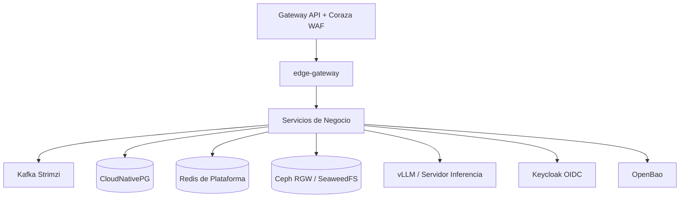
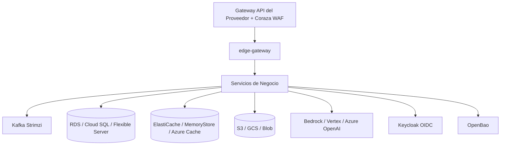

# Despliegue Multi-Destino

## 1. Principio Arquitectónico

Despliegue basado en núcleo portable. Lógica de negocio agnóstica al entorno. Interacciones externas mediadas por adaptadores por proveedor ocultos tras puertos Java (`ObjectStore`, `ImmutableStore`, `KeyService`, `LlmProvider`). 

El uso de Kafka (Strimzi) y OpenBao en formato self-hosted se justifica estrictamente por la necesidad de asegurar portabilidad total y consistencia de comportamiento transversal entre nubes e instalaciones locales, no por ausencia de servicios gestionados similares. Garantizan que el pipeline de eventos y la inyección de secretos funcionen idénticamente en cualquier destino.

## 2. Dependencias y Destinos

| Componente | Puerto Java | Self-hosted | AWS | GCP | Azure |
|---|---|---|---|---|---|
| Kubernetes | N/A | k3s / RKE2 / OpenShift | EKS | GKE | AKS |
| Kafka | Spring Kafka | Strimzi | Strimzi | Strimzi | Strimzi |
| BD Relacional + pgvector | JDBC | CloudNativePG (CNPG) | RDS / CNPG | Cloud SQL / CNPG | Flexible Server / CNPG |
| Caché / Rate Limit | Lettuce | Redis HA (Plataforma) | ElastiCache | MemoryStore | Azure Cache for Redis |
| Objetos (Datos) | `ObjectStore` | Ceph RGW / SeaweedFS | S3 | GCS nativo | Blob nativo |
| WORM (Auditoría) | `ImmutableStore` | S3 Object Lock compliance | S3 Object Lock | Bucket Lock | Immutable storage bloqueado |
| Llaves (Tenant) | `KeyService` (envelope)| OpenBao Transit | AWS KMS | Cloud KMS | Key Vault / Managed HSM |
| Secretos Dinámicos | N/A | OpenBao | OpenBao | OpenBao | OpenBao |
| Identidad (OIDC) | N/A | Keycloak | Keycloak | Keycloak | Keycloak |
| Identidad de workload | N/A | ServiceAccount + OpenBao | EKS Pod Identity | Workload Identity | Workload Identity |
| LLM | `LlmProvider` | vLLM (GPU) | Bedrock | Vertex AI | Azure OpenAI / AI Foundry |
| WAF / Ingress | N/A | Gateway API + Coraza | Gateway API (Ingress de AWS) | Gateway API (GKE Gateway) | Gateway API (App Gateway) |
| Antivirus | N/A | ClamAV (sidecar + CronJob) | ClamAV | ClamAV | ClamAV |

## 3. Perfiles de Despliegue

La plataforma se despliega en dos perfiles base mediante Helm umbrella en `deploy/helm`, aplicando valores (`values.yaml`) según el destino. La Infraestructura como Código (IaC) emplea OpenTofu en `infra/opentofu/{aws,gcp,azure}`.

### 3.1. Perfil Self-Hosted

Despliegue integral on-premise o en nube privada pura. Todos los servicios de respaldo se ejecutan dentro de Kubernetes o infraestructura dedicada adyacente.

### 3.2. Perfil Managed (Nube Pública AWS, GCP, Azure)

Despliegue donde los recursos básicos (Kubernetes, S3/GCS, Caché, KMS, LLM) son delegados a servicios gestionados nativos por el proveedor, manteniendo el núcleo portable.

## 4. Ambientes y Flujo GitOps

El flujo de despliegue se orquesta estrictamente mediante GitOps utilizando Argo CD. 

### 4.1. Ambientes
*   **Local**: Ejecución basada en Testcontainers o Docker Compose para desarrollo diario.
*   **Integración**: Entorno k3s o kind, automatizado en CI/CD para verificación de ramas `develop`.
*   **Staging**: Clúster Kubernetes con Alta Disponibilidad (HA). Simula producción para QA y pruebas de rendimiento.
*   **Producción**: Entorno final HA, segregado a nivel de red y cuentas cloud.

### 4.2. Verificación de Portabilidad
Se asegura la neutralidad de la nube durante el ciclo CI/CD:
*   Pruebas unitarias y de integración locales empleando LocalStack (AWS), Azurite (Azure) y fake-gcs-server (GCP).
*   Instalación de Helm en `kind` durante el pipeline de CI para comprobar empaquetado.
*   `tools/ci/check_helm_env.py` (job `kind-e2e`): extrae de cada `application.yml` los placeholders `${VAR}` sin default (fail-closed) y las variables con fail-fast conocido, renderiza el chart con todos los `values-*.yaml` y falla con `servicio X: falta VAR` si un Deployment no las inyecta, o si un `secretKeyRef`/volumen apunta a un Secret que ningun ExternalSecret, values o KafkaUser declara. `--self-test` muta el render (variable quitada, secret inexistente, servicio sin Deployment) y exige que el verificador falle. Local: `HELM_BIN=<ruta a helm> python tools/ci/check_helm_env.py` (requiere PyYAML). Un servicio nuevo o una variable nueva sin default exige cablearla en `deploy/helm/idp/templates/_workload.tpl`.
*   Ejecución de pruebas Smoke en clústeres reales (AWS, GCP, Azure) aprovisionados bajo demanda con OpenTofu, destruidos tras finalizar su validación.

## 5. Topología y Red (Seguridad Perimetral e Interna)

La comunicación interna emplea mTLS gestionado por cert-manager. La topología de red sigue el principio de menor privilegio mediante reglas de NetworkPolicy `deny-by-default` aplicadas por namespace.

### 5.1. Restricciones de Ingress y Egress
*   **gateway (`edge-gateway`)**: Único servicio expuesto públicamente. Implementa Gateway API con WAF Coraza (implementación subyacente según fase F3, como Envoy Gateway o nativa del proveedor). Consume Redis compartido para rate limiting y exporta rechazos perimetrales (401 y 429) al SIEM.
*   **renderer**: Entorno sandbox aislado de alta seguridad. Su NetworkPolicy aprueba tráfico entrante de forma exclusiva desde `document-service` (invocación HTTP síncrona). Egress denegado. No posee credenciales propias, almacenamiento persistente, ni acceso a Kafka. Se despliega mediante patrón sidecar junto a `clamd`. Las firmas de antivirus se actualizan utilizando un CronJob `freshclam` independiente, único con autorización de egress hacia el mirror interno.
*   **notification-service**: Único servicio de negocio autorizado para iniciar egress hacia internet, destinado exclusivamente a webhooks. Implementa defensas anti-SSRF rigurosas: bloqueo total a RFC1918, direcciones de metadata, link-local 169.254/16, CGNAT 100.64/10 e IPv6 ULA. Ejecuta resolución de DNS mediante pinning para neutralizar ataques TOCTOU.

### 5.2. Degradación y Equidad
*   **Redis Compartido**: Dedicado a persistir contadores temporales para protección DDoS y rate limiting a nivel gateway. No almacena datos de negocio ni PII de inquilinos. Ante fallo total, el limitador ejecuta degradación segura hacia memorias locales del pod.
*   **Bulkhead Resilience4j**: Workers encargados de procesamiento pesado o consumo de APIs LLM aíslan su capacidad operativa por tenant. El tope previene acaparamientos sistemáticos, garantizando respuesta equitativa bajo carga.

## 6. Dimensionamiento, HA y Escalabilidad

Cada servicio exige declaración estricta de solicitudes (requests) y topes (limits). Habilitan escalabilidad elástica y retienen quórum HA en despliegues no locales.

### 6.1. Dimensionamiento de Plataforma
Servicios estructurales dimensionados para garantizar estabilidad operativa mínima en entornos formales:
*   **Kafka (Strimzi)**: 3 brokers (HA). 1.0 CPU, 2Gi RAM por broker.
*   **CNPG (CloudNativePG)**: 3 instancias (1 primaria, 2 réplicas). 2.0 CPU, 4Gi RAM por instancia.
*   **OpenBao**: 3 instancias (raft HA). 0.5 CPU, 1Gi RAM por instancia.
*   **Keycloak**: 2 instancias. 1.0 CPU, 2Gi RAM por instancia.
*   **Loki (Logging)**: 0.5 CPU, 1Gi RAM (escalable según ingesta).
*   **Redis**: 3 instancias (Sentinel/Cluster). 0.5 CPU, 1Gi RAM por nodo.

### 6.2. Sizing Base por Servicio y Perfil Dev

| Servicio | Perfil de Carga | CPU Request | RAM Request | CPU Limit | RAM Limit |
|---|---|---|---|---|---|
| edge-gateway | I/O intensivo | 0.5 | 512Mi | 2.0 | 1Gi |
| document-service | Orquestación / I/O | 1.0 | 1Gi | 2.0 | 2Gi |
| renderer | CPU/RAM intensivo | 2.0 | 2Gi | 4.0 | 4Gi |
| extraction-service | CPU, memoria, I/O LLM | 2.0 | 2Gi | 4.0 | 4Gi |
| chat-service | I/O LLM, pgvector | 1.0 | 1Gi | 2.0 | 2Gi |
| demás servicios | Lógica de negocio | 0.5 | 512Mi | 1.0 | 1Gi |

*Perfil Dev (Local)*: Recursos reducidos drásticamente. Utiliza 1 réplica por componente. Kafka corre en modo kraft single-node; CNPG con 1 instancia; servicios Java ajustan heap a 256Mi/512Mi.

### 6.3. HA, PDB y HPA
*   **Alta Disponibilidad (HA)**: Topologías de Staging y Producción escalan por defecto a 3 réplicas (Multi-AZ).
*   **PodDisruptionBudget (PDB)**: Establecido globalmente con `minAvailable: 2` durante mantenimiento de nodos.
*   **HorizontalPodAutoscaler (HPA)**: 
    *   Microservicios core escalan por métricas sintéticas de CPU (70%) y Memoria (80%).
    *   Consumidores Kafka escalan usando métricas externas (Prometheus) de lag de tópicos y latencia LLM.

## 7. Cadena de Suministro y Plataforma Kubernetes

### 7.1. Operadores y Versiones de Dominio (F3)
*   **Plataforma K8s**: Despliegue nativo con operadores (cert-manager, Strimzi, CNPG, Keycloak, kube-prometheus-stack, Kyverno, OpenBao, Argo CD). Implementación de Ingress basada estrictamente en Gateway API.
*   **Gestión Transaccional**: Prohibido el uso de transacciones distribuidas complejas (JTA). Se emplea almacenamiento base independiente combinando transacciones locales y Outbox transaccional diferido mediante ShedLock.

### 7.2. Verificación y Aislamiento de Ejecución
*   Clúster configurado bajo perfil Pod Security Standards `restricted`.
*   Imágenes Docker ensambladas bajo modelo rootless con compatibilidad para UID dinámicos y arbitrarios (OpenShift).
*   **Cadena de Suministro Confianza Cero (ADR 0022)**:
    *   Código estático protegido mediante SAST (CodeQL / Semgrep).
    *   Imágenes y dependencias validadas por SCA (Trivy y Dependabot).
    *   Generación de SBOM (CycloneDX).
    *   Firmas de contenedor utilizando `cosign`.
    *   El motor de admisión rechaza despliegues sin firma validada mediante reglas `verifyImages` en Kyverno (OPA descartado).

## 8. Aprovisionamiento Físico del Tenant

La segregación de tenants materializa un diseño de silo puro administrado mediante el `tenant-service`.

*   **Bases de Datos Lógicas y Clusters CNPG**: Vía API de Kubernetes, `tenant-service` provisiona objetos lógicos (Database anclada a Cluster general) o Clusters completos dedicados según el nivel de inquilino.
*   **Exclusión de Argo CD**: Recursos generados dinámicamente quedan fuera del control de Argo CD. Su fuente de verdad reside en la base de control, reconciliando disparidades mediante Jobs periódicos en Kubernetes.
*   **Brokers de Eventos**: Kafka en modo KRaft. Sin segregación artificial mediante credenciales aisladas; seguridad basada en ACLs unificadas por `KafkaUser`.

## 9. Backup, Disaster Recovery y Criptografía

El aseguramiento y continuidad de datos relacionales quedan formalizados bajo el diseño ADR 0025:

*   **Barman Cloud sobre CNPG**: Quedan retirados perfiles legados utilizando Patroni o pgBackRest. Exportación gestionada por Barman Cloud hacia el almacenamiento de objetos con retención continua de WAL.
*   **Crypto-Shredding (Controles D11)**: La erradicación criptográfica asegura inaccesibilidad total frente a retiro de tenants. Exige deshabilitación inmediata en OpenBao/KMS de las KEK involucradas, ejecutando la destrucción definitiva e irrevocable del material base de cifrado al finalizar la ventana de retención (cooling-off) del proveedor de infraestructura.
*   **Cifrado de Recuperación**: Las llaves administradas en OpenBao Transit o KMS nativos son inexportables. La estrategia ante caídas masivas depende de capacidades nativas KMS Multi-Región o topologías de réplica OpenBao DR.

## 10. Calibración por Destino (No Herencia)

Las métricas base de los motores de Lenguaje Natural oscilan dramáticamente entre el empaquetado vLLM local y APIs hiper-escalares de nube.

*   **Prohibición de Herencia**: Los umbrales de precisión automática (`τ_auto`) y revisión manual (`τ_revisar`) no se importan ni exportan entre configuraciones.
*   **Calibración Aislada**: Mandataria por ambiente, atada estrictamente al par modelo+prompt en dicho servidor mediante ejecución masiva de golden sets de evaluación.

## 11. Licenciamiento

El diseño mitiga asimetrías de proveedor y riesgos de licenciamiento:
*   **OpenBao**: (Mozilla Public License) previene esquemas Business Source License de Hashicorp Vault.
*   **OpenTofu**: Evade restricciones privativas de Terraform.
*   **Almacenamiento**: Ceph RGW / SeaweedFS homologados como predeterminados; uso de MinIO expresamente restringido y prohibido.
