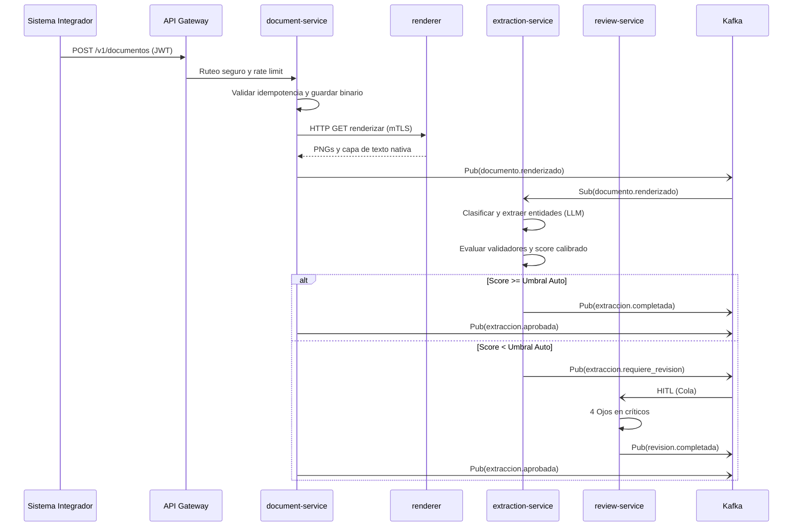

# Producto: IDP Bancario

## 1. Visión y problema

Los bancos reciben diariamente miles de oficios judiciales de embargo y desembargo (tipologías EC, EJ, DC, DJ) provenientes de diferentes autoridades y juzgados. La extracción manual de los datos contenidos en estos oficios (radicados, partes involucradas, montos, límites, productos afectados) es un proceso lento, propenso a errores humanos y riesgoso operativamente, pudiendo resultar en sanciones regulatorias o afectación indebida a los clientes (por ejemplo, doble aplicación de un embargo o inmovilización de fondos incorrectos).

Este producto (IDP Bancario) resuelve el problema centralizando la ingesta, clasificación y extracción automatizada de la información de los oficios mediante un motor basado en IA (LLM multimodal), validaciones determinísticas y una cola de revisión humana (HITL) solo para excepciones. Además, incorpora un chat documental con citación verificable (RAG) que sirve como herramienta rápida y confiable para consultar información específica del documento sin necesidad de leerlo en su totalidad manualmente.

## 2. Alcance y fuera de alcance

**En alcance:**
* Ingesta y orquestación del ciclo de vida documental mediante API.
* Procesamiento y rasterizado seguro de oficios (formatos PDF, imágenes y DOCX).
* Clasificación automática y extracción de entidades y tablas complejas para oficios EC, EJ, DC, DJ.
* Motor de fiabilidad determinístico y probabilístico con umbrales calibrados para auto-aprobación o derivación.
* Tipologías configurables por YAML con validación fail-fast y versionado estricto.
* Interfaz API para revisión humana (HITL) de campos dudosos con regla de cuatro ojos para campos críticos.
* Aprobación obligatoria por un Data Steward para documentos marcados como Altamente Confidencial.
* Chat documental sobre un documento individual con citación verificable (RAG), soporte cross-lingual, detección de prompt injection, caché con autorización equivalente y mecanismo de feedback.
* Remediación y ofuscación (DLP/PII) de datos sensibles previa indexación.
* Failover multi-proveedor LLM y circuit breaker para alta resiliencia.
* Notificación de eventos a sistemas del banco mediante webhooks seguros (HMAC, anti-SSRF).
* Cuotas de consumo por plan o subunidad de negocio con alertas tempranas al 80% y 100%.
* Almacenamiento seguro por tenant, con auditoría WORM inmutable y gobierno estricto (KMS, OpenBao, retención).
* Backend completo, desplegable en Kubernetes (multi-cloud y on-premise) con mTLS operado vía cert-manager.
* Taxonomía de errores estandarizada para clientes API y conciliación de consumo.
* Exportación y portabilidad de expedientes y datos estructurados.

**Fuera de alcance:**
* Frontend de usuario final: el IDP provee exclusivamente APIs.
* Motor de OCR tradicional: se confía en LLM multimodal y capas de texto nativas.
* Integración directa con los sistemas core bancarios: el banco orquesta su lado consumiendo webhooks.
* Gestión de usuarios y roles del tenant: el sistema delega la autenticación y roles a un IdP federado (Keycloak) gestionado por el banco.
* Hojas de cálculo (Excel, CSV): no soportadas para ingesta documental.
* Búsqueda general, listado de documentos cruzados y chat con contradicciones entre múltiples documentos: esto corresponde a un CMS tradicional o a una fase futura (Fase 2).
* Streaming de respuestas en el chat documental.
* Interfaz propia para MFA: cubierto por el IdP federado del banco.

## 3. Actores y roles RBAC

El sistema delega la autenticación a un broker OIDC (Keycloak). Cada solicitud se revalida contra la base de control local.

| Rol | Descripción | Accesos permitidos | Accesos prohibidos |
|---|---|---|---|
| **Sistema Integrador** | Aplicación core del banco que ingesta oficios y recibe webhooks. | Cargar documentos, consultar estado, descargar datos extraídos (solo su tenant). | Acceder a configuraciones, modelos, auditoría o revisión HITL. |
| **Revisor HITL** | Operador humano que corrige campos dudosos. | Ver colas de revisión, leer imágenes de páginas, corregir campos no críticos (1 ojo) o proponer corrección de críticos (2 ojos). | Descargar documento completo, alterar reglas, aprobar críticos sin segundo revisor. |
| **Data Steward** | Administra el golden set y aprueba documentos de alto riesgo. | Acceso al golden set sintético, tableros de drift, aprobación de documentos Altamente Confidenciales. | Ver oficios reales en crudo sin motivo, modificar umbrales sin pasar por CI. |
| **Oficial de Seguridad** | Monitorea incidentes, controles y accesos. | Ver logs de seguridad, eventos de prompt injection, logs de denegación de acceso. | Leer contenido documental, alterar expedientes WORM. |
| **Soporte / Break-glass** | Interviene operativamente en incidentes severos. | Acceso temporal de emergencia con justificación auditada, TTL y aprobador distinto. | Acceso anónimo o persistente a datos. |
| **Auditoría / Compliance** | Revisa registros inmutables frente a disputas o reguladores. | Leer expedientes WORM, trazas de hash-chain, auditoría de KEKs. Actúa como Regulador. | Borrar o alterar auditorías (rol WORM no revocable). |
| **Administrador de Tenant** | Gestiona los parámetros del tenant particular. | Rotar webhooks, ajustar cuotas de subunidades, generar reportes de acceso trimestrales. | Acceso cruzado a otros tenants, operar pods o K8s. |
| **Facturación** | Concilia consumos del sistema. | Consultar agregados de consumo y cuotas, reportes de uso. | Leer PII de cualquier tipo. |
| **Administrador Plataforma** | Opera la infraestructura base (K8s, Kafka, DBs). | Gestionar ciclo de vida de tenants vía API, cuotas globales, despliegues Argo CD. | Acceder al silo de tenants, poseer llaves KEK. |

## 4. Clasificación de información

El acceso a la información sigue el principio de mínimo privilegio estricto.

1. **Público:** Información abierta, umbrales documentados genéricos, esquemas OpenAPI, taxonomía de errores.
2. **Interno:** Manuales de operaciones del IDP, métricas globales anónimas, RTO/RPO y topología de red.
3. **Confidencial (Por defecto para oficios):** Contenido del oficio, radicados, nombres, montos. El acceso se restringe al tenant y rol.
4. **Altamente Confidencial:** Documentos marcados por el tenant (ej. montos masivos o figuras públicas). Su extracción y visualización exige aprobación de un Data Steward distinto del cargador.
5. **Restringido:** KEKs (datos y auditoría), tokens WORM, secretos de LLM. Requiere cifrado, crypto-shredding y OpenBao.

## 5. Requisitos funcionales

### 5.1 Ingesta y orquestación
* **RF-101 Estados canónicos:** El documento transita obligatoriamente los estados: RECIBIDO, RECHAZADO, RENDERIZADO, EN_EXTRACCION, EN_REVISION, APROBADO, FALLIDO.
* **RF-102 Ingesta idempotente y validación fail-fast:** API recibe oficios asegurando unicidad por hash de archivo y por tupla (tipología, radicado, versión). Los esquemas de extracción se configuran en YAML con validación fail-fast.
* **RF-103 Sandbox de rasterizado:** Todo PDF/DOCX/imagen se renderiza a imágenes (PNG) y se extrae su capa de texto nativa en un pod aislado (sin credenciales, sin egress). Rechaza archivos con malware vía sidecar ClamAV.

### 5.2 Extracción y fiabilidad
* **RF-201 Clasificación de tipología:** Reconoce automáticamente Embargo de Cuentas (EC), Embargo Judicial (EJ), Desembargo de Cuentas (DC) o Desembargo Judicial (DJ).
* **RF-202 Extracción basada en evidencia:** Extrae radicados, autoridades, demandantes, demandados y tablas. Todo dato requiere evidencia espacial (bounding boxes).
* **RF-203 Ruteo por Score:** Rutea a APROBADO si el score supera el umbral autocalibrado (τ_auto). Valores entre τ_revisar y τ_auto disparan una segunda pasada LLM en cascada. Por debajo de τ_revisar, va a HITL.
* **RF-204 Validadores determinísticos:** Reglas estrictas: radicado de 23 dígitos, concordancia del dígito de verificación en NIT (cédulas validan formato/longitud sin dígito de verificación), montos en letras igual a números. El fallo envía el campo a HITL.

### 5.3 Revisión Humana (HITL)
* **RF-301 Corrección acotada:** El revisor corrige campos dudosos.
* **RF-302 Cuatro Ojos en críticos:** Corregir campos críticos (monto, identificación, cuenta/producto, tipo de medida) exige aprobación de un segundo revisor (usuario distinto). Los campos dudosos no críticos o sin corrección se despachan con un revisor.

### 5.4 Chat Documental (RAG)
* **RF-401 Citación exacta:** Toda afirmación incluye cita estricta a la capa de texto o OCR parcial.
* **RF-402 Prevención de alucinaciones:** Abstención obligatoria indicando "información insuficiente" si el contexto no contiene la respuesta (SEC-048).
* **RF-403 Seguridad en Chat:** Detección de prompt injection, caché con autorización heredada, filtrado DLP/PII pre-indexación, soporte cross-lingual y feedback explícito.

### 5.5 Integración y consumo
* **RF-501 Webhooks seguros:** Notifica `extraccion.aprobada` y `documento.rechazado`. Salida filtrada por anti-SSRF (pinning DNS, bloqueo de IPs privadas y metadata), firmas HMAC rotativas.
* **RF-502 Failover LLM:** Circuit breaker ante fallos del proveedor LLM principal con degradación elegante al proveedor secundario.

### 5.6 Auditoría y WORM
* **RF-601 Trazabilidad inmutable:** Todo evento (aprobaciones, prompt inyectado, accesos denegados) va a un tópico Kafka auditable y luego a almacenamiento WORM inmutable por tenant.
* **RF-602 Expediente firmado:** Generación de un ancla criptográfica con hash-chain del documento, usando una llave asimétrica para validación pública.
* **RF-603 Purga y Habeas Data:** Crypto-shredding (destrucción de KEK de datos, conservando KEK de auditoría) ante solicitud de borrado, emitiendo evento `documento.purgado`.

## 6. Requisitos no funcionales

* **RNF-101 Aislamiento Multitenant (Silo):** Cada tenant opera en una base de datos lógica exclusiva (PostgreSQL), un bucket exclusivo, y KEKs exclusivas generadas por OpenBao.
* **RNF-102 Disponibilidad multi-cloud:** Backend empaquetado para EKS, GKE, AKS u OpenShift (sin root, UID arbitrario). Certificados mTLS operados mediante cert-manager (no requiere service mesh pesado).
* **RNF-103 Cuotas y Rate Limit:** Limitación en API Gateway apoyada por Redis para protección contra vecinos ruidosos, y cuotas rígidas (alertas al 80% y 100%) por tenant/subunidad.
* **RNF-104 Recuperación frente a desastres:** Objetivos RTO/RPO documentados y medidos (RPO definido por el WAL de CloudNativePG).
* **RNF-105 Resiliencia basada en eventos:** Consumidores Kafka idempotentes, patrón Outbox transaccional y Claim-check para evitar PII en los tópicos.

## 7. Reglas de negocio

* **RN-01 Unicidad estricta:** Un oficio se identifica unívocamente por el hash de su archivo o por (tipología, radicado, versión). Un documento de desembargo (DC/DJ) que referencia a su contraparte de embargo (EC/EJ) NO es un duplicado, son trámites distintos que se asocian.
* **RN-02 Exactitud Numérica:** Discrepancia entre monto en letras y números es fallo de validación duro.
* **RN-03 Validez de Demandados (NIT/CC):** Un NIT requiere validación módulo 11 exacta. Una CC o CE valida únicamente formato y longitud.
* **RN-04 Jurisdicción:** La autoridad o juzgado debe resolverse contra el catálogo del banco.
* **RN-05 Suma de Tablas:** La sumatoria de filas de montos en una tabla debe coincidir exactamente con el valor total declarado del oficio.
* **RN-06 Autorización Break-glass:** El acceso de emergencia exige un aprobador distinto, registro inmutable del ticket, TTL corto y visibilidad diferida para el tenant.
* **RN-07 Calidad del Golden Set:** Las correcciones manuales HITL jamás retroalimentan directamente modelos con datos reales; solo generan métricas para sintetizar oficios ficticios en el ambiente seguro de calibración.

## 8. KPIs

* **Precisión y Recall:** Medidos a nivel de campo contra oficios sintéticos.
* **Tasa STP (Straight Through Processing):** Porcentaje de oficios procesados sin intervención humana.
* **Tasa HITL:** Porcentaje de oficios derivados a revisión (total o parcial).
* **Error Silente:** Defectos en documentos auto-aprobados, evaluados mediante un muestreo ciego (1-2%).
* **Latencia p95:** Tiempo end-to-end de extracción excluyendo tiempo de espera humano.
* **Fidelidad del Chat:** Porcentaje de respuestas donde el modelo se apega estrictamente a la cita base sin alucinar.
* **Costo E2E:** Costo en invocaciones de IA y cómputo por documento.

## 9. Diagrama de flujo de alto nivel

